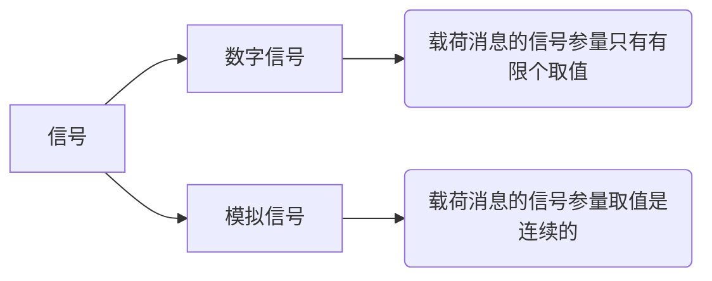
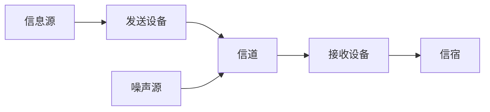
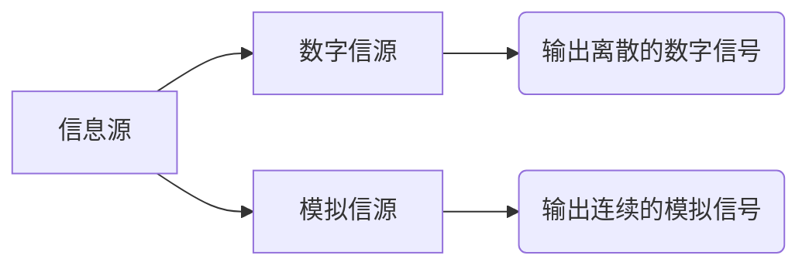
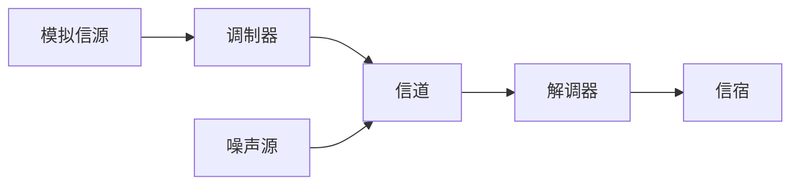
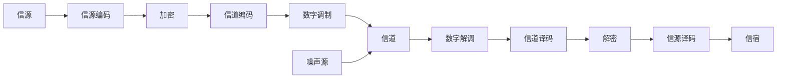

---
tags:
    - 绪论
created: 2021-10-11T06:19:44.019Z
modified: 2021-10-11T07:07:18.501Z
---
# 1. 1 通信的基本概念

**通信**`发送者和接受者之间通过某种媒体进行的信息传递`

**消息** `通信系统传输的对象，是信息的载体`

**信息**  `消息中所包含的有效内容`

**信号** `消息的传输载体`

# 1.2 通信系统模型
## 1.2.1 通信系统的一般模型

**信息源** `把各种消息转换成原始电信号`

**发送设备** `产生适合于在信道中传输的信号,使发送信号的特性和信道特性相匹配,具有抗信道干扰的能力,并且具有足够的功率以满足远距离传输的需要`

**信道** `一种物理媒质,用来将来自发送设备的信号传送到接受端。`

**接收设备** `将信号放大和反变化(如译码、解调等)，其目的是从受到减损的接受信号中正确恢复出原始电信号`

**信宿** `传送消息的目的地，把原始电信号还原成相应的消息`

## 1.2.2 模拟通信系统模型

## 1.2.2 数字通信系统模型

